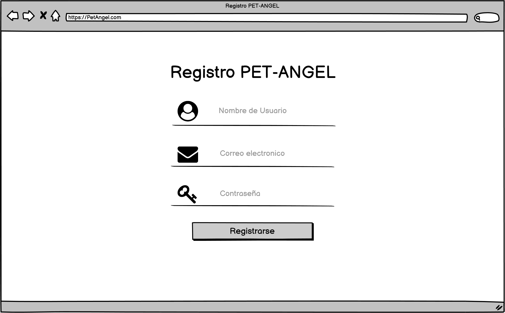
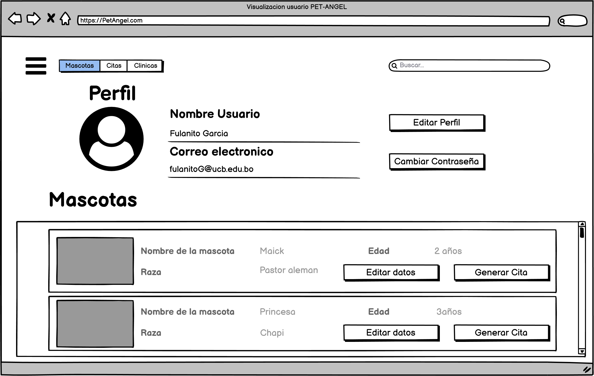

# Historias de Usuario
## Ingeniería del Software (SIS - 213)

## PET-ANGEL
---

# Historias de Usuario
## Ingeniería del Software (SIS - 213)

### TITULO DEL PROYECTO PET-ANGEL

## Introducción
En el presente documento se puede observar las historias de usuario para la plataforma de mascotas “PET-ANGELS”. Una historia de usuario es una representación de los requisitos que se precisan para la elaboración de un sistema, es un lenguaje que permite a cualquier individuo entender con facilidad sin tener conocimiento previo en informática o programación.

## Objetivo
Identificar los requisitos del sistema y plasmarlo en el documento para desarrollar de forma precisa la plataforma mencionada y explicar los procesos que se llevarán a cabo.

## A quién está dirigido

Esta plataforma es principalmente informativa sobre el buen cuidado y crianza de las mascotas, agilizando cada uno de los procesos que actualmente se lleva acabó en las clínicas veterinarias, logrando brindar un mejor servicio a los clientes. Contando con voluntarios que estarán al cuidado de las mascotas con el servicio de guardería, los cuales tendrán un acceso al descuento Angels. Pet-Angeles busca destacar, ofreciendo contacto con las diferentes clínicas certificadas que se encuentren afiliados a la plataforma.

## Niveles de prioridad
Los niveles de prioridad serán en función al efecto que tenga en el núcleo del sistema, que en esta plataforma sería la . Para este sistema se definen los siguientes niveles de prioridad:

1. Alta: Este módulo afecta al núcleo del sistema directamente, por lo tanto es indispensable.
2. Medio: El módulo afecta al núcleo del sistema parcialmente.
3. Bajo: Afecta al núcleo del sistema de forma externa, sin embargo es prescindible.

## **Historias de Usuario**
### **01. Ingreso al sistema como usuario/cliente**

**Número**: 001      **Usuario**: Clientes

**Nombre de la historia**: Ingreso al sistema como usuario/cliente

**Prioridad en el Negocio**:Medio             **Riesgo de desarrollo**: Bajo

**Programador responsable:** 

**Validación:**  El usuario debe tener una cuenta registrada para poder acceder a la plataforma, los campos a introducir deben contar con el formato correcto :correo sin caracteres invalidos y contrasenia minima de 8 caracteres.

#### **Descripción:**
El usuario al ingresar a la pagina de PetAngel se le pedira realizar un inicio de sesion para acceder a la plataforma de consultas de la pagina (Fig-1) se debe ingresar el correo y la contrasenia, si el usuario no cuenta con una cuenta registrada debe de registrarse.

**### 02.  Registro al sistema como cliente**

**Número:** 002   **Usuario:** Clientes 

**Nombre de la historia:** Registro al sistema como cliente

**Prioridad en el Negocio:** Medio            **Riesgo de desarrollo:** Bajo

**Programador responsable:**

**Validación:** Para que un usuario nuevo se registre en la plataforma debe ingresar un nombre de usuario, correo y crear una contraseña. Estos campos deben tener caracteres válidos y todos son obligatorios.

#### **Descripción:**
Si es que un usuario es nuevo, este debe crear una nueva cuenta, ingresando al formulario de registro el cual se encuentra en la parte inferior central de la página de inicio de sesión (Figura 1) como un link. El usuario podrá crear su cuenta ingresando los siguientes datos:
- Nombre de Usuario.
- Correo.
- Contraseña.

### **03. Registro de usuario como "voluntario"**

**Numero:** 003 **Usuario:** Voluntarios

**Nombre de la historia:** *Registro en el sistema como voluntario*

**Prioridad en el Negocio:** *Medio*

**Riesgo de desarrollo:** *Medio*

**Programador responsable:** *Porcel Peña Jhoan*

**Validación:** *Se debe validar el nombre de usuario, correo electronico, numero de celular, contraseña*

#### **Descripcion:**
El presente registro lo harán los usuarios que desean, con los siguientes datos:
- Nombre de usuario.
- E-mail.
- Contraseña.
- numero de celular.
- Numero de emergencia.

### **04. Visualización del perfil del cliente**

**Número:** 004      **Usuario:**

**Nombre de la historia:** Visualización del perfil del cliente
**Prioridad en el Negocio:**  Medio           **Riesgo de desarrollo:** Bajo

**Programador responsable:**

**Validación:** El usuario puede observar sus datos que se registró en la plataforma, además en la parte inferior se observa el historial de consultas que tiene, por otra parte, se observa algunas opciones que puede editar y/o agregar los datos para hacer mas completo su perfil:
- Nombre de Usuario.
- Nombre de la mascota.
- Raza de la mascota.
- Edad de la mascota.
- Correo.
- País / Ciudad.

También tendrá las opciones de edición con los botones de:
- Editar perfil.
- Cambiar contraseña.

En la parte de mascotas tiene una descripción detallada de las mascotas que tiene registradas en su perfil:
- Nombre de la mascota.
- Raza de la mascota.
- Edad de la mascota.
- Generar cita

#### **Descripción:**
El usuario podrá ver su perfil, revisar sus datos registrados en la plataforma y observar las mascotas que registro en la plataforma mediante una lista en la parte inferior de la interfaz. Finalmente, los campos más importantes son los datos del usuario y las consultas generadas que tiene.

### **05. Edicion de Perfil del Cliente**

**Número:** 005     **Usuario:** Clientes

**Nombre de la historia:** Edición del perfil del cliente

**Prioridad en el Negocio:** Alta            **Riesgo de desarrollo:** Alta

**Programador responsable:** 

**Validación:** En la figura se puede observar los campos que puede editar el usuario, como ser las
opciones de la edición de datos, que son:
- Nombre del usuario.
- Correo.
- Ciudad.
- País.
Por otra parte en la actualización de la contraseña solo se observa los campos de ingreso de la
nueva contraseña más la verificación de la nueva y la validad de la antigua contraseña.

Finalmente la parte de actualizacion de las mascotas registradas el usuario podra cambiar los siguientes campos:
- Nombre de la mascota.
- Raza de la mascota.
- Edad de la mascota.

#### **Descripción:**
El cliente tiene registrado sus datos personales en la plataforma, por lo cual, puede editar sus datos como ser el nombre del usuario, el correo electrónico del usuario, además la ubicación actual del usuario como ser el país y ciudad. Por lo tanto, el usuario puede editar la contraseña actual con una contraseña nueva.

### **06. Visualización del perfil de clinica**

**Numero:** *006*
**Usuario:** clientes nivel clinica

**Nombre de la historia:** *Visualización del perfil de clinica*

**Prioridad en el Negocio:** *Medio*

**Riesgo de desarrollo :** *bajo*

**Programador responsable :** *Porcel Peña Jhoan*

**Validación:** *Se deberá visualizar los datos generales de las clinicas como:* 
- Nombre
- Teléfono
- Nombre de operadora
- ubicación de la clínica
- Tipos de atención
- Horario de atención
- Veterinarios a cargo segun el horario.
- Sección de video llamadas o llamadas de emergencia
- Sección de mascotas atendidas
- Una calificación justificada de la clínica

#### **Descripcion:**
Todos los usuarios registrados en general,podrán visualizar la información proporcionada por la clinica veterinaria, la cual estará en su perfil de la misma.

### **07. Visualización de la pantalla principal"**

**Numero:** *007*
**Usuario:** clientes en general

**Nombre de la historia:** *Visualización de la pantalla principal*

**Prioridad en el Negocio:** *Medio*

**Riesgo de desarrollo :** *bajo*

**Programador responsable :** *Porcel Peña Jhoan*

**Validación:** *Se deberá visualizar la información necesaria de la "empresa"* 

#### **Descripcion:**
Todos los usuarios registrados en general,podrán visualizar la información proporcionada por la "empresa".

### **008.**

**Número:** 008      **Usuario:**

**Nombre de la historia:**

**Prioridad en el Negocio:**             **Riesgo de desarrollo:**

**Programador responsable:**

**Validación:**

#### **Descripción:**

### **009.**

**Número:** 009      **Usuario:**

**Nombre de la historia:**

**Prioridad en el Negocio:**             **Riesgo de desarrollo:**

**Programador responsable:**

**Validación:**

#### **Descripción:**

### **010.**

**Número:** 010      **Usuario:**

**Nombre de la historia:**

**Prioridad en el Negocio:**             **Riesgo de desarrollo:**

**Programador responsable:**

**Validación:**

#### **Descripción:**

## Conclusion

Después de un análisis minucioso de los requerimientos necesarios para la plataforma de cuidado de mascotas "PET-ANGEL"”, se cumplió con el objetivo del documento, logrando identificar los requisitos indispensables para el funcionamiento idóneo de la plataforma.

Cada proceso fue detallado y descrito a lo largo del documento para que sea entendible para cualquier individuo. No obstante, es necesario aclarar que hay algunos procesos y funciones que serán externos en la primera versión del sistema.

Cabe recalcar que si bien se identificaron los requisitos principales, a medida que se lleva a cabo el desarrollo del sistema es inevitable que vayan apareciendo más requisitos, los cuales serán documentados paralelamente.

