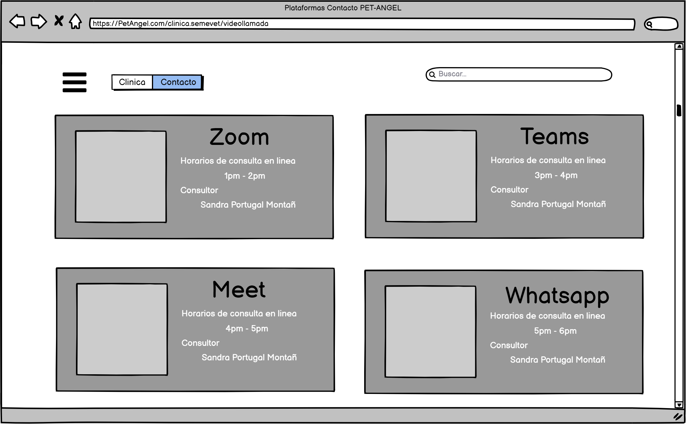
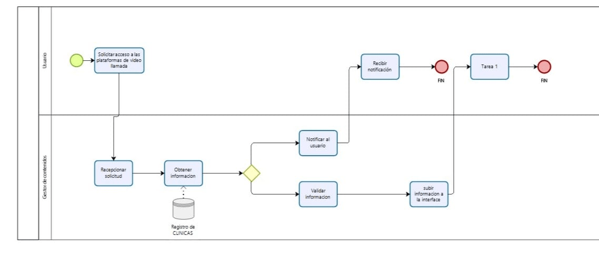


# Historias de Usuario
## Ingeniería del Software (SIS - 213)

## PET-ANGEL
---
# Historias de Usuario
## Ingeniería del Software (SIS - 213)

Integrantes

* Sergio Troche
* Roxana Vargas
* Ivan Mamani
* Jhoan Porcel

## INDICE GENERAL

1. Introducción
2. Objetivo
3. A quien esta dirigido
4. Niveles de prioridad
5. Historias de usuario
  * 5.1 Ingreso al sistema como usuario/cliente
  * 5.2 Registro al sistema como cliente
  * 5.3 Registro de usuario como "voluntario
  * 5.4 Edición de Perfil del Cliente
  * 5.5 Visualización del perfil del cliente
  * 5.6 Visualización clínicas
  * 5.7 Visualización del perfil de clínica
  * 5.8 Visualización de plataformas de video llamada
  * 5.9 Creación de la cuenta del administrador
  * 5.10 Recuperación de contraseña
   
   
   
## INDICE DE FIGURAS

* Figura 001 : inicio de sesión
* Figura 002 : Registro de cuenta
* Figura 003 : Registro de cuenta nivel voluntario
* Figura 004 : Modificacion de perfil 
* Figura 005 : Perfil del cliente
* Figura 006 : plataforma de clinicas
* Figura 007 : perfil de clinicas
* Figura 008 : plataforma video llamada
* Figura 009 : registro de administrador
* Figura 010 : Recuperacion de contraseña

## INDICE DE PROCESOS

* Proceso 001: Proceso para inicio de sesión
* Proceso 002: Proceso para Registro de cuenta
* Proceso 003: Proceso para Registro de cuenta nivel voluntario
* Proceso 004: Proceso para Modificacion de perfil 
* Proceso 005: Proceso para Perfil del cliente
* Proceso 006: Proceso para plataforma de clinicas
* Proceso 007: Proceso para perfil de clinicas
* Proceso 08: Proceso para plataforma video llamada
* Proceso 09: Proceso para registro de administrador
* Proceso 010: Proceso para Recuperacion de contraseña

# TITULO DEL PROYECTO PET-ANGEL

## Introducción
En el presente documento se puede observar las historias de usuario para la plataforma de mascotas “PET-ANGELS”. Una historia de usuario es una representación de los requisitos que se precisan para la elaboración de un sistema, es un lenguaje que permite a cualquier individuo entender con facilidad sin tener conocimiento previo en informática o programación.

## Objetivo
Identificar los requisitos del sistema y plasmarlo en el documento para desarrollar de forma precisa la plataforma mencionada y explicar los procesos que se llevarán a cabo.

## A quién está dirigido

Esta plataforma es principalmente informativa sobre el buen cuidado y crianza de las mascotas, agilizando cada uno de los procesos que actualmente se lleva acabó en las clínicas veterinarias, logrando brindar un mejor servicio a los clientes. Contando con voluntarios que estarán al cuidado de las mascotas con el servicio de guardería, los cuales tendrán un acceso al descuento Angels. Pet-Angeles busca destacar, ofreciendo contacto con las diferentes clínicas certificadas que se encuentren afiliados a la plataforma.

## Niveles de prioridad
Los niveles de prioridad serán en función al efecto que tenga en el núcleo del sistema, que en esta plataforma sería la . Para este sistema se definen los siguientes niveles de prioridad:

1. Alta: Este módulo afecta al núcleo del sistema directamente, por lo tanto es indispensable.
2. Medio: El módulo afecta al núcleo del sistema parcialmente.
3. Bajo: Afecta al núcleo del sistema de forma externa, sin embargo es prescindible.

## **Historias de Usuario**

### **01. Ingreso al sistema como usuario/cliente**

**Número**: 001      **Usuario**: Clientes

**Nombre de la historia**: Pagina Principal de pagina

**Prioridad en el Negocio**:Bajo           **Riesgo de desarrollo**: Bajo

**Programador responsable:** *Troche Mayta Sergio*

**Validación:**  El Usuario podra ver la informacion basica de la Pagina(Fig-001).

Fig-001

#### **Descripción:**

### **02. Seleccion de Crear perfil de Cliente o Voluntario*

**Número**: 002      **Usuario**: Clientes/Voluntarios

**Nombre de la historia**: Seleccion de Crear perfil de Usuario o Voluntario

**Prioridad en el Negocio**:Medio             **Riesgo de desarrollo**: Bajo

**Programador responsable:** *Troche Mayta Sergio*

**Validación:** El Usuario o Voluntario tendra que seleccionar que tipo de perfil quiere crearse si de Usuario o de Voluntario.
#### **Descripción:**

Fig-001

### **03. Ingreso al sistema como usuario/cliente**

**Número**: 003      **Usuario**: Clientes

**Nombre de la historia**: Ingreso al sistema como usuario/cliente

**Prioridad en el Negocio**:Medio             **Riesgo de desarrollo**: Bajo

**Programador responsable:** *Troche Mayta Sergio*

**Validación:**  El usuario debe tener una cuenta registrada para poder acceder a la plataforma, los campos a introducir deben contar con el formato correcto :correo sin caracteres inválidos y contraseña mínima de 8 caracteres.

#### **Descripción:**
El usuario al ingresar a la pagina de Pet-Angel se le pedirá realizar un inicio de sesión para acceder a la plataforma de consultas de la pagina (Fig-1) se debe ingresar el correo y la contraseña, si el usuario no cuenta con una cuenta registrada debe de registrarse.

Fig-001

#### Proceso

P-001

### **03.  Registro al sistema como cliente**

**Número:** 003   **Usuario:** Clientes 

**Nombre de la historia:** Registro al sistema como cliente

**Prioridad en el Negocio:** Medio            **Riesgo de desarrollo:** Bajo

**Programador responsable:** *Troche Mayta Sergio*

**Validación:** Para que un usuario nuevo se registre en la plataforma debe ingresar un nombre de usuario, correo y crear una contraseña. Estos campos deben tener caracteres válidos y todos son obligatorios.

#### **Descripción:**
Si es que un usuario es nuevo, este debe crear una nueva cuenta, ingresando al formulario de registro el cual se encuentra en la parte inferior central de la página de inicio de sesión (Fig-002) como un link. El usuario podrá crear su cuenta ingresando los siguientes datos:
- Nombre de Usuario.
- Correo.
- Contraseña.

Fig-002

#### Proceso

P-002

### **04. Registro de usuario como "voluntario"**

**Numero:** 004 **Usuario:** Voluntarios

**Nombre de la historia:** *Registro en el sistema como voluntario*

**Prioridad en el Negocio:** *Medio*

**Riesgo de desarrollo:** *Medio*

**Programador responsable:** *Porcel Peña Jhoan*

**Validación:** *Se debe validar el nombre de usuario, correo electrónico, numero de celular, contraseña*

#### **Descripción:**
El presente registro lo harán los usuarios que desean, con los siguientes datos (Fig-003):
- Nombre de usuario.
- E-mail.
- Contraseña.
- numero de celular.

Fig-003

#### Proceso

P-003

### **04. Visualización del perfil del cliente**

**Número:** 004      **Usuario:**

**Nombre de la historia:** Visualización del perfil del cliente
**Prioridad en el Negocio:**  Medio           **Riesgo de desarrollo:** Bajo

**Programador responsable:** *Troche Mayta Sergio*

**Validación:** El usuario puede observar sus datos que se registró en la plataforma, además en la parte inferior se observa el historial de consultas que tiene, por otra parte, se observa algunas opciones que puede editar y/o agregar los datos para hacer mas completo su perfil:
- Nombre de Usuario.
- Nombre de la mascota.
- Raza de la mascota.
- Edad de la mascota.
- Correo.
- País / Ciudad.

También tendrá las opciones de edición con los botones de:
- Editar perfil.
- Cambiar contraseña.

En la parte de mascotas tiene una descripción detallada de las mascotas que tiene registradas en su perfil:
- Nombre de la mascota.
- Raza de la mascota.
- Edad de la mascota.
- Generar cita

#### **Descripción:**
El usuario podrá ver su perfil, revisar sus datos registrados en la plataforma y observar las mascotas que registro en la plataforma mediante una lista en la parte inferior de la interfaz. Finalmente, los campos más importantes son los datos del usuario y las consultas generadas que tiene(Fig-004).

Fig-004

#### Proceso

P-004

### **05. Edición de Perfil del Cliente**

**Número:** 005     **Usuario:** Clientes

**Nombre de la historia:** Edición del perfil del cliente

**Prioridad en el Negocio:** Alta            **Riesgo de desarrollo:** Alta

**Programador responsable:** *Troche Mayta Sergio*

**Validación:** En la figura se puede observar los campos que puede editar el usuario, como ser las
opciones de la edición de datos, que son:
- Nombre del usuario.
- Correo.
- Ciudad.
- País.
Por otra parte en la actualización de la contraseña solo se observa los campos de ingreso de la
nueva contraseña más la verificación de la nueva y la validad de la antigua contraseña.

Finalmente la parte de actualización de las mascotas registradas el usuario podrá cambiar los siguientes campos:
- Nombre de la mascota.
- Raza de la mascota.
- Edad de la mascota.

#### **Descripción:**
El cliente tiene registrado sus datos personales en la plataforma, por lo cual, puede editar sus datos como ser el nombre del usuario, el correo electrónico del usuario, además la ubicación actual del usuario como ser el país y ciudad. Por lo tanto, el usuario puede editar la contraseña actual con una contraseña nueva (Fig-005).

Fig-005

#### Proceso

P-005

### **06. Visualización del perfil de clínica**

**Numero:** *006*
**Usuario:** clientes nivel clínica

**Nombre de la historia:** *Visualización del perfil de clínica*

**Prioridad en el Negocio:** *Medio*

**Riesgo de desarrollo :** *bajo*

**Programador responsable :** *Porcel Peña Jhoan*

**Validación:** *Se deberá visualizar los datos generales de las clínicas como:* 

- Nombre
- Teléfono
- Nombre de operadora
- ubicación de la clínica
- Tipos de atención
- Horario de atención
- Veterinarios a cargo según el horario.
- Sección de video llamadas o llamadas de emergencia
- Sección de mascotas atendidas
- Una calificación justificada de la clínica

#### **Descripción:**
Todos los usuarios registrados en general,podrán visualizar la información proporcionada por la clínica veterinaria, la cual estará en su perfil de la misma(Fig-006).

Fig-006

#### Proceso

P-006

### **07. Visualización clínicas**

**Numero:** *007*

**Usuario:** clientes en general

**Nombre de la historia:** *Visualización de la pantalla principal*

**Prioridad en el Negocio:** *Medio*

**Riesgo de desarrollo :** *bajo*

**Programador responsable :** *Porcel Peña Jhoan*

**Validación:** *Se vera las clinicas veterinarias que se encuentran registradas en el sistema"* 

#### **Descripción:**
Todos los usuarios registrados en general,podrán visualizar la información de las diferentes clinicas"(Fig-007).

Fig-007

Fig-007

#### Proceso

P-007

### **08. Suscripcion a la pagina**

**Numero:** 008

**Usuario:** Clientes

**Nombre de la historia:** Visualización de la pantalla principal

**Prioridad en el Negocio:** Alto

**Riesgo de desarrollo :** Medio

**Programador responsable :** Troche Mayta Sergio Denis

**Validación:** Se vera las clinicas veterinarias que se encuentran registradas en el sistema

#### **Descripción:**
Para la suscripcion a la pagina se tiene solamente un metodo y es por el pago por transaccion bancaria, el cleinte presiona en

Fig-007

Fig-007

#### Proceso

P-007

### **009. Visualización de plataformas de video llamada**

**Número:** 008      **Usuario:** Paciente

**Nombre de la historia:** Visualización de plataformas de video llamada

**Prioridad en el Negocio:**  Media          **Riesgo de desarrollo:** Bajo

**Programador responsable:**

**Validación:** 

El Usuario podrá elegir la plataforma de video llamada con la cual esten mas familiarizado.

#### **Descripción:**

El Usuario tendrá a su disposición varias plataformas donde pueda el realizar video llamadas (Zoom, Whatsapp, Meet, Telegram, Messeger) así el podrá escoger la tecnología con el que se sienta mas cómodo. (Fig-008)

Fig-008

#### Proceso

P-008

### **009.  Creación de la cuenta del administrador**

**Número:** 009     **Usuario:**

**Nombre de la historia: Creación de la cuenta del administrador**

**Prioridad en el Negocio: Medio**             **Riesgo de desarrollo: Alta**

**Programador responsable:** *Troche Mayta Sergio*

**Validación:  Solo el administrador principal puede registrar a un nuevo administrador para lograr
apoyar el sistema, los características que el usuario debe llenar en el sistema son:**

- Nombre de Usuario.
- Correo.
- Celular.
- País / Ciudad.
- Contraseña.
- Pregunta frecuente y respuesta**

Fig-009 “Creación de la cuenta del administrador”.

#### Proceso

P-009

#### **Descripción: El administrador principal de la plataforma puede agregar a un nuevo administrador, por otra parte los datos más importantes son la contraseña de usuario y la pregunta de seguridad.**

### **010.  Recuperación de contraseña ** 

**Número:** 010      **Usuario:**

**Nombre de la historia: Recuperar contraseña**

**Prioridad en el Negocio: Medio**             **Riesgo de desarrollo: Medio**

**Programador responsable:** *Troche Mayta Sergio*
 
**Validación: Para recuperar la contraseña el usuario lo hará con una opción en la pantalla de inicio
de sesión o cuando se equivoque tres veces al momento de realizar este último..
Para esta función, el sistema le pedirá la respuesta a su pregunta seguridad y su nueva contraseña.
La contraseña tendrá que tener el mismo formato que al crear una cuenta.
Al darle a “Recuperar Cuenta” le dará un mensaje de confirmación o de error dependiendo el caso.**

#### **Descripción:  La recuperación de contraseña es una funcionalidad que permite que el usuario pueda recuperar su contraseña en caso de olvidarla. Para esto es necesario que conozca su pregunta de seguridad.**

Fig-010 

#### Proceso

P-010

Para el proceso de recuperar contraseña se puede entrar de dos formas. Una directamente desde la
página de iniciar sesión o equivocándose 3 veces al iniciar sesión. Una vez dentro se pedirá la
respuesta a la pregunta de seguridad y una nueva contraseña. Si todo salió correcto el sistema le
devolverá un mensaje de confirmación de la recuperación de contraseña.

## **Conclusión**

Después de un análisis minucioso de los requerimientos necesarios para la plataforma de cuidado de mascotas "PET-ANGEL", se cumplió con el objetivo del documento, logrando identificar los requisitos indispensables para el funcionamiento idóneo de la plataforma.

Cada proceso fue detallado y descrito a lo largo del documento para que sea entendible para cualquier individuo. No obstante, es necesario aclarar que hay algunos procesos y funciones que serán externos en la primera versión del sistema.

Cabe recalcar que si bien se identificaron los requisitos principales, a medida que se lleva a cabo el desarrollo del sistema es inevitable que vayan apareciendo más requisitos, los cuales serán documentados paralelamente.

### **02. Ingreso al sistema como usuario/cliente**

**Número**: 002      **Usuario**: Clientes

**Nombre de la historia**: Ingreso al sistema como usuario/cliente

**Prioridad en el Negocio**:Medio             **Riesgo de desarrollo**: Bajo

**Programador responsable:** *Troche Mayta Sergio*

**Validación:**
#### **Descripción:**

Fig-001

#### Proceso

P-001
