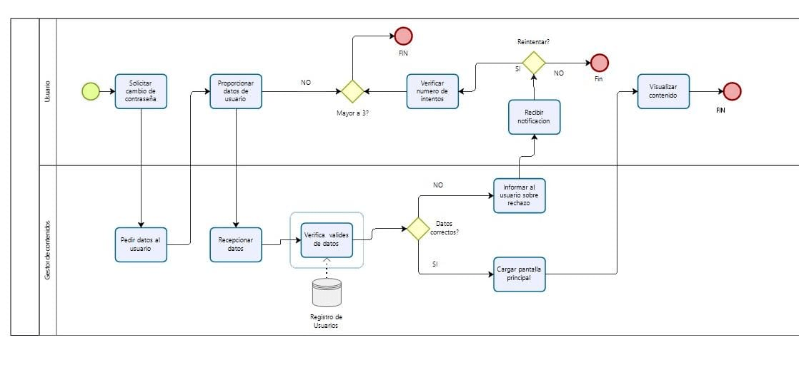
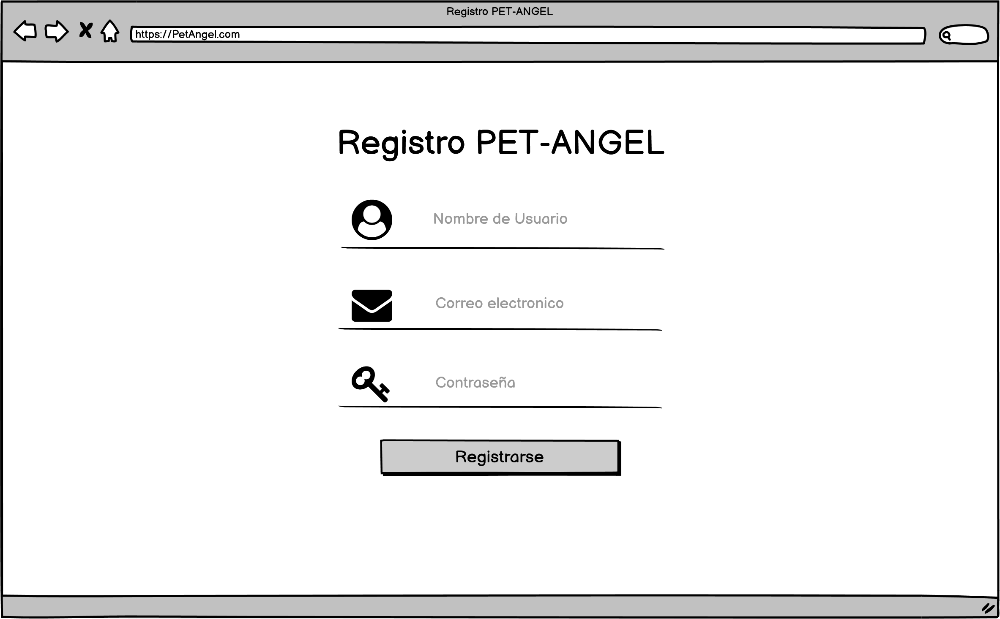
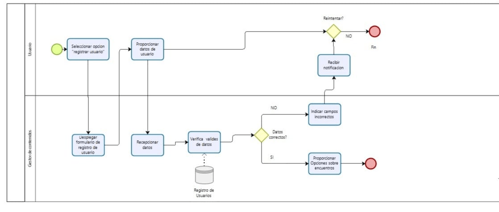
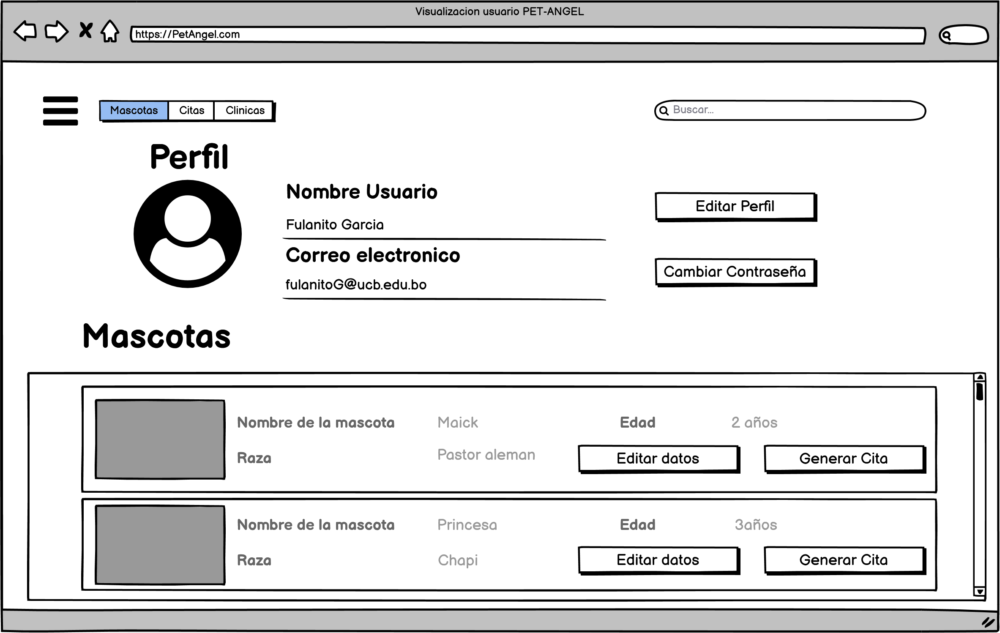
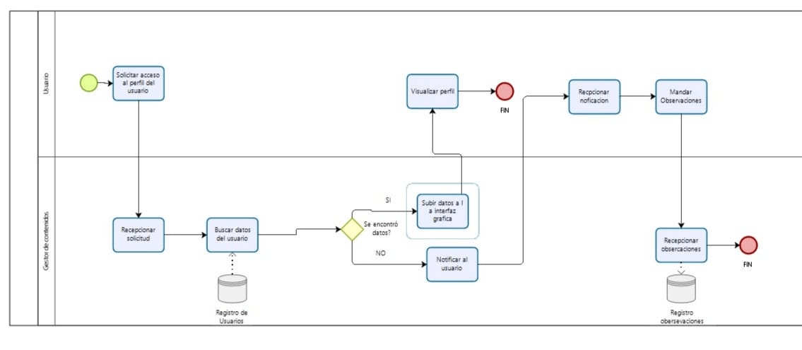
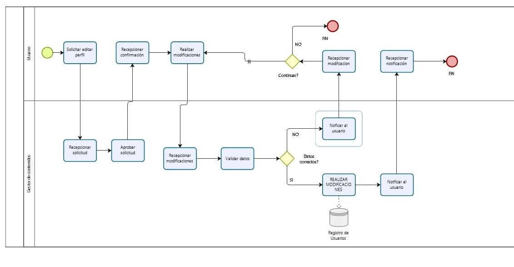
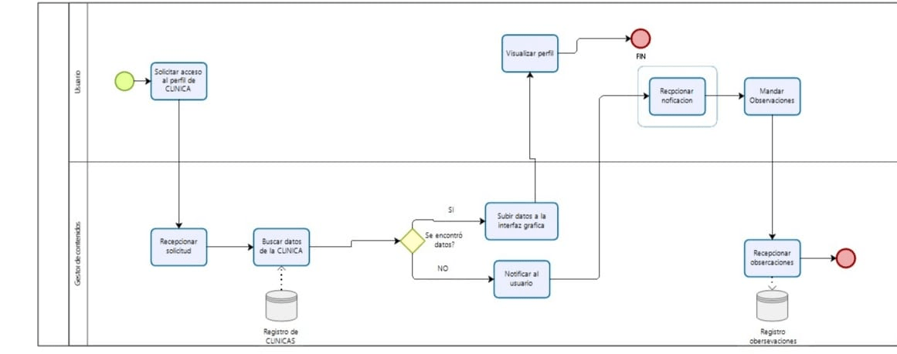
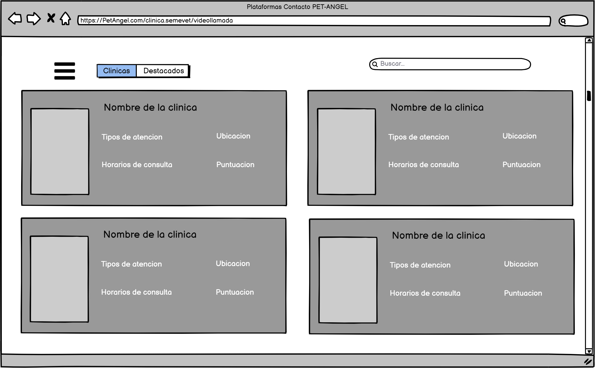
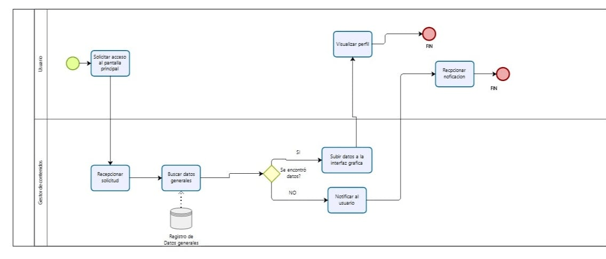


# Historias de Usuario
## Ingeniería del Software (SIS - 213)

## PET-ANGEL
---
# Historias de Usuario
## Ingeniería del Software (SIS - 213)

Integrantes

* Sergio Troche
* Roxana Vargas
* Ivan Mamani
* Jhoan Porcel

## INDICE GENERAL

1. Introducción
2. Objetivo
3. A quien está dirigido
4. Niveles de prioridad
5. Historias de usuario
  * 5.1 Visualización de la pantalla de inicio
  * 5.2 Ingreso al sistema como usuario/cliente
  * 5.3 Recuperación de contraseña
  * 5.4 Registro al sistema como cliente
  	* 5.4.1 Registro de mascotas
  * 5.5 Visualización del perfil cliente  
  * 5.6 Edición del perfil cliente
  * 5.7 Registro de usuario como "voluntario"
  * 5.8 Registro de usuario como veterinaria
  * 5.9 Visualización del perfil veterinaria
  * 5.10 Visualización de clínicas
  * 5.11 Solicitud de citas médicas en veterinaria
  * 5.12 Visualización de citas médicas aceptadas o rechazadas
  * 5.13 Solicitud de cuidado de mascotas
	* 5.13.1 Visualización de voluntarios cercanos
  * 5.14 Solicitud de citas médicas virtuales de emergencia por video llamada 
  * 5.15 Visualización de plataformas de video llamada para emergencias

   
## INDICE DE FIGURAS

* Figura 001 : Pantalla de inicio
* Figura 002 : Inicio de sesión
* Figura 003 : Recuperación de contraseña
* Figura 004 : Registro de cuenta cliente
* Figura 005 : Perfil cliente
* Figura 006 : Modificación de perfil cliente 
* Figura 007 : Registro de cuenta voluntario
* Figura 008 : Registro de cuenta veterinaria
* Figura 009 : Perfil Veterinaria
* Figura 010 : Listado de clínicas
* Figura 011 : Citas médicas en veterinaria 
* Figura 012 : Citas médicas aceptadas o rechazadas
* Figura 013 : Servicio de cuidado de mascotas
* Figura 014 : Citas médicas virtuales de emergencia
* Figura 015 : Plataformas de video llamadas

 
## INDICE DE PROCESOS

* Proceso 001: Proceso para entrar a la página web
* Proceso 002: Proceso para inicio de sesión
* Proceso 003: Proceso para recuperación de contraseña
* Proceso 004: Proceso para registro de cuenta cliente
* Proceso 005: Proceso para visualización perfil cliente
* Proceso 006: Proceso para edición de perfil cliente
* Proceso 007: Proceso para registro de cuenta voluntario
* Proceso 008: Proceso para registro de cuenta veterinaria
* Proceso 009: Proceso para visualización perfil veterinaria
* Proceso 010: Proceso para visualización de plataforma de clínicas
* Proceso 011: Proceso para solicitud de cita médica en veterinaria
* Proceso 012: Proceso para visualización de citas médicas aceptadas o rechazadas
* Proceso 013: Proceso para solicitud de cuidado de mascotas
* Proceso 014: Proceso para solicitud de citas médicas virtuales de emergencia
* Proceso 015: Proceso para visualización de plataformas de video llamada

# TITULO DEL PROYECTO PET-ANGEL

## Introducción
En el presente documento se puede observar las historias de usuario para la plataforma de mascotas “PET-ANGELS”. Una historia de usuario es una representación de los requisitos que se precisan para la elaboración de un sistema, es un lenguaje que permite a cualquier individuo entender con facilidad sin tener conocimiento previo en informática o programación.

## Objetivo
Identificar los requisitos del sistema y plasmarlo en el documento para desarrollar de forma precisa la plataforma mencionada y explicar los procesos que se llevarán a cabo.

## A quién está dirigido

Esta plataforma es principalmente informativa sobre el buen cuidado y crianza de las mascotas, agilizando cada uno de los procesos que actualmente se lleva acabó en las clínicas veterinarias, logrando brindar un mejor servicio a los clientes. Contando con voluntarios que estarán al cuidado de las mascotas con el servicio de guardería, los cuales tendrán un acceso al descuento Angels. Pet-Angeles busca destacar, ofreciendo contacto con las diferentes clínicas certificadas que se encuentren afiliados a la plataforma.

## Niveles de prioridad
Los niveles de prioridad serán en función al efecto que tenga en el núcleo del sistema, que en esta plataforma sería la . Para este sistema se definen los siguientes niveles de prioridad:

1. Alta: Este módulo afecta al núcleo del sistema directamente, por lo tanto es indispensable.
2. Medio: El módulo afecta al núcleo del sistema parcialmente.
3. Bajo: Afecta al núcleo del sistema de forma externa, sin embargo es prescindible.

## **Historias de Usuario**

### **01. Visualización pantalla inicial**

**Número**: 001      **Usuario**: Clientes/Médicos/Voluntarios

**Nombre de la historia**: Vista inicial de la página web

**Prioridad en el Negocio**: Medio                          **Riesgo de desarrollo**: Bajo

**Programador responsable:** *Roxana Vargas Telleria*

**Validación:**  El Usuario podrá ver la información básica de la página pero sin toda la información completa, además de que podrá ver algunos consejos para el cuidado de su mascota (Fig-001).

Fig-001

#### **Descripción:**

### **02. Ingreso al sistema como usuario/cliente**

**Número**: 002     **Usuario**: Clientes

**Nombre de la historia:** Ingreso al sistema como usuario/cliente

**Prioridad en el Negocio**: Medio             **Riesgo de desarrollo**: Bajo

**Programador responsable:** *Troche Mayta Sergio*

**Validación:** El usuario debe tener una cuenta registrada para poder acceder a la plataforma, los campos a introducir deben contar con el formato correcto: contraseña mínima de 8 caracteres.

#### **Descripción:**
El usuario al ingresar a la página de Pet-Angel se le pedirá realizar un inicio de sesión para acceder a la plataforma de consultas de la página (Fig 002) se debe ingresar el correo y la contraseña, si el usuario no cuenta con una cuenta registrada debe registrarse.

Fig-001

#### Proceso

P-001

### **03.  Recuperación de contraseña ** 

**Número:** 003      **Usuario:** Clientes/Clínicas/Voluntarios

**Nombre de la historia:** Recuperar contraseña

**Prioridad en el Negocio:** Medio             **Riesgo de desarrollo:** Medio

**Programador responsable:** *Troche Mayta Sergio*
 
**Validación:** Para recuperar la contraseña el usuario lo hará con una opción en la pantalla de inicio
de sesión o cuando se equivoque tres veces al ingresar su contraseña.
Para esta función, el sistema le pedirá la respuesta a su pregunta de seguridad y su nueva contraseña.
La contraseña deberá tener el mismo formato que al crear una cuenta. (Fig 003)
Al darle a “Recuperar Cuenta” le dará un mensaje de confirmación o de error dependiendo el caso.

#### **Descripción:**  La recuperación de contraseña es una funcionalidad que permite que el usuario pueda recuperar su contraseña en caso de olvidarla. Para esto es necesario que conozca su pregunta de seguridad.

Fig-010 

#### Proceso

P-010

### **04.  Registro al sistema como cliente**

**Número:** 004   **Usuario:** Clientes 

**Nombre de la historia:** Registro al sistema como cliente

**Prioridad en el Negocio:** Medio            **Riesgo de desarrollo:** Bajo

**Programador responsable:** *Troche Mayta Sergio*

**Validación:** Para que un usuario nuevo se registre en la plataforma debe ingresar un nombre de usuario, correo y crear una contraseña. Todos son obligatorios.
Una vez validado el correo electrónico ingresado deberá registrar a sus mascotas.

#### **Descripción:**
Si es que un usuario es nuevo, este debe crear una nueva cuenta, ingresando al formulario de registro el cual se encuentra en la parte inferior central de la página de inicio de sesión (Fig-004) como un link. El usuario podrá crear su cuenta ingresando los siguientes datos:
- Nombre de Usuario.
- Correo.
- Contraseña.
Una vez validado el correo electrónico ingresado aparecerá un formulario para que pueda registrar a sus mascotas.

Fig-002

#### Proceso

P-002

### **05. Visualización del perfil del cliente**

**Número:** 005      **Usuario:**

**Nombre de la historia:** Visualización del perfil del cliente

**Prioridad en el Negocio:**  Medio           **Riesgo de desarrollo:** Bajo

**Programador responsable:** *Troche Mayta Sergio*

**Validación:** El usuario puede observar los datos que registró en la plataforma, además en la parte inferior se observa el historial de consultas que tiene hasta la fecha.
Se observa los siguientes datos, los cuales puede modificar con el transcurso del tiempo:
- Nombre de Usuario.
- Correo electrónico
- Dirección
- Ubicación de la dirección en Google maps

En la parte de mascotas tiene una descripción detallada de las mascotas que tiene registradas en su perfil:
- Nombre de la mascota.
- Raza de la mascota.
- Edad de la mascota.
- Generar cita

También tendrá las opciones de edición con los botones de:
- Editar perfil.
- Cambiar contraseña.

#### **Descripción:**
El usuario podrá ver su perfil, revisar sus datos registrados en la plataforma y observar las mascotas que registro mediante una lista en la parte inferior de la interfaz. 
Finalmente, los campos más importantes son los datos del usuario y las consultas generadas que tiene (Fig-005).

Fig-004

#### Proceso

P-004

### **06. Edición de Perfil del Cliente**

**Número:** 006     **Usuario:** Clientes

**Nombre de la historia:** Edición del perfil del cliente

**Prioridad en el Negocio:** Alta            **Riesgo de desarrollo:** Alta

**Programador responsable:** *Troche Mayta Sergio*

**Validación:** En la figura se puede observar los campos que puede editar el usuario:
- Nombre de usuario
- Contraseña
- Numero de teléfono
- Dirección
- Ciudad
- País

Por otra parte, en la actualización de la contraseña solo se observa los campos de ingreso de la
nueva contraseña más la verificación de la nueva y la validación de la antigua contraseña.

Finalmente, la parte de actualización de las mascotas registradas el usuario podrá cambiar los siguientes campos:

- Nombre de la mascota.
- Raza de la mascota.
- Edad de la mascota.

#### **Descripción:**
El cliente tiene registrado sus datos personales en la plataforma, los cuales puede editar para tener siempre información actualizada.
Puede editar datos como ser el nombre del usuario, la dirección actual del usuario como ser el país y ciudad. También puede editar la contraseña actual con una contraseña nueva (Fig-006).

Fig-005

#### Proceso

P-005

### **07. Registro de usuario como "voluntario"**

**Numero:** 007       **Usuario:** Voluntarios

**Nombre de la historia:** *Registro en el sistema como voluntario*

**Prioridad en el Negocio:** *Medio*          **Riesgo de desarrollo:** *Medio*

**Programador responsable:** *Porcel Peña Jhoan*

**Validación:** *Se debe validar el nombre de usuario, correo electrónico, numero de celular, contraseña*

#### **Descripción:**
El presente registro lo harán los usuarios que deseen ser voluntarios, con los siguientes datos (Fig-007):
- Nombre de usuario.
- E-mail.
- Contraseña.
- Numero de celular.
- Dirección
- Ubicación de su dirección en Google maps

Fig-003

#### Proceso

P-003

### **08. Registro de usuario como veterinaria**

**Numero:** 008                  **Usuario:** Veterinarias

**Nombre de la historia:** *Registro en el sistema como veterinaria*

**Prioridad en el Negocio:** *Medio*          **Riesgo de desarrollo:** *Medio*

**Programador responsable:** *Roxana Vargas Telleria*

**Validación:** *Se debe validar el nombre de usuario, correo electrónico, numero de celular, contraseña*

#### **Descripción:**
El presente registro lo harán los usuarios de clínicas veterinarias que deseen ser parte del sistema, con los siguientes datos (Fig-008):
- Nombre de usuario.
- E-mail.
- Contraseña.
- Numero de celular.
- Dirección de la clínica.
- Ubicación de su dirección en Google maps.
- Numero de registro de clínica autorizada.
- Especialidades
- Tipos de servicios ofrecidos.
- Horarios de atención

Fig-003

#### Proceso

P-003

### **09. Visualización del perfil veterinaria**

**Numero:** *09*     **Usuario:** clientes nivel clínica

**Nombre de la historia:** *Visualización del perfil de clínica*

**Prioridad en el Negocio:** *Medio*              **Riesgo de desarrollo:** *bajo*

**Programador responsable:** *Porcel Peña Jhoan*

**Validación:** *Se deberá visualizar los datos generales de las clínicas como:* 

- Nombre
- Teléfono
- Nombre de operadora
- ubicación de la clínica
- Tipos de atención
- Horario de atención
- Veterinarios a cargo según el horario.
- Sección de video llamadas o llamadas de emergencia
- Sección de mascotas atendidas
- Una calificación justificada de la clínica

#### **Descripción:**
Todos los usuarios registrados en general, podrán visualizar la información proporcionada por la clínica veterinaria, la cual estará en su perfil (Fig-009).

Fig-006

#### Proceso

P-006

### **10. Visualización de clínicas**

**Numero:** *010*      **Usuario:** Clientes en general

**Nombre de la historia:** *Visualización de la pantalla principal*

**Prioridad en el Negocio:** *Medio*             **Riesgo de desarrollo:** *bajo*

**Programador responsable:** *Porcel Peña Jhoan*

**Validación:** *Se vera las clínicas veterinarias que se encuentran registradas en el sistema"* 

#### **Descripción:**
Todos los usuarios registrados en general, podrán visualizar la información de las diferentes clínicas"(Fig-010).

Fig-007

Fig-007

#### Proceso

P-007

### **11. Solicitud de cita médica en veterinaria**

**Numero:** *011*      **Usuario:** Clientes en general

**Nombre de la historia:** *Solicitud cita médica en veterinaria*

**Prioridad en el Negocio:** *Alto*             **Riesgo de desarrollo:** *Medio*

**Programador responsable:** *Roxana Vargas Telleria*

**Validación:** *Se vera las clínicas veterinarias que se encuentran registradas en el sistema y cada una tendrá un botón para poder reservar una cita. 
Al presionar el botón de la clínica preferida se observa los horarios de atención de esta, se debe llenar un formulario con la fecha y hora para la cita deseada, además de una breve descripción del motivo de la cita y a cuál mascota registrada pertenecería dicha cita.
La solicitud debe ser respondida y confirmada por la clínica veterinaria y apenas sea respondida debe enviar una notificación al solicitante"* 

#### **Descripción:**
Todos los usuarios registrados en general, podrán realizar una solicitud de cita"(Fig-011).

Fig-007

#### Proceso

P-007

### **12. Visualización de citas médicas aceptadas o rechazadas**

**Numero:** *012*      **Usuario:** Clientes en general

**Nombre de la historia:** *Citas médicas aceptadas o rechazadas*

**Prioridad en el Negocio:** *Alto*             **Riesgo de desarrollo:** *Medio*

**Programador responsable: ** *Roxana Vargas Telleria*

**Validación:** *Se tendrá un apartado donde se podrá observar todas las citas médicas solicitadas y si estas fueron respondidas, aceptadas o rechazadas por la clínica veterinaria"* 

#### **Descripción:**
Todos los usuarios registrados en general, podrán visualizar si sus citas médicas fueron aceptadas o rechazadas por la clínica"(Fig-012).

Fig-007

#### Proceso

P-007

### **13. Solicitud de cuidado de mascotas**

**Numero:** *013*      **Usuario:** Clientes en general

**Nombre de la historia:** *Solicitud de cuidado de mascotas*

**Prioridad en el Negocio:** *Alto*             **Riesgo de desarrollo:** *Medio*

**Programador responsable:** *Roxana Vargas Telleria*

**Validación:** *Se podrá solicitar el cuidado de una mascota por algunas horas en el día llenando el formulario correspondiente.
En este formulario se podrá ver a todos los voluntarios cercanos a su domicilio y escoger a cualquiera de ellos por libre elección"* 

#### **Descripción:**
Todos los usuarios registrados en general, podrán realizar una solicitud de cuidado de mascotas"(Fig-013).

Fig-007

#### Proceso

P-007

### **14. Solicitud de cita médica virtual de emergencia**

**Numero:** *014*      **Usuario:** Clientes en general

**Nombre de la historia:** *Solicitud cita médica de emergencia*

**Prioridad en el Negocio:** *Alto*             **Riesgo de desarrollo :** *Medio*

**Programador responsable:** *Roxana Vargas Telleria*

**Validación:** *Para casos de emergencia y en horas fuera del horario de atención de las clínicas se podrá solicitar una cita virtual por distintas plataformas (Zoom, Meets, Whatsapp y Teams).
Habrá un botón "EMERGENCIA" en cada clínica que se habilitara cuando termine su horario de atención, al presionar dicho botón se tendrá que llenar un formulario con una breve descripción del motivo de la emergencia, después podrá observar todas las plataformas disponibles para realizar la video llamada"* 

#### **Descripción: **
Todos los usuarios registrados en general, podrán realizar una solicitud de cita de emergencia"(Fig-014).

Fig-007

#### Proceso

P-007

### **15. Visualización de plataformas de video llamada**

**Numero:** *015*      **Usuario:** Clientes en general

**Nombre de la historia:** *Visualización plataformas de video llamada*

**Prioridad en el Negocio:** *Alto*             **Riesgo de desarrollo:** *Medio*

**Programador responsable:** *Roxana Vargas Telleria*

**Validación:** *El usuario podrá escoger la plataforma con la cual este más familiarizado.
Al presionar sobre una plataforma simplemente se redireccionará a un link directo que será proporcionado por la clínica,"* 

#### **Descripción:**
Todos los usuarios que hayan solicitado una cita médica virtual de emergencia podrán observar las plataformas disponibles"(Fig-007).

Fig-007

#### Proceso

P-007

## **Conclusión**

Después de un análisis minucioso de los requerimientos necesarios para la plataforma de cuidado de mascotas "PET-ANGEL", se cumplió con el objetivo del documento, logrando identificar los requisitos indispensables para el funcionamiento idóneo de la plataforma.

Cada proceso fue detallado y descrito a lo largo del documento para que sea entendible para cualquier individuo. No obstante, es necesario aclarar que hay algunos procesos y funciones que serán externos en la primera versión del sistema.

Cabe recalcar que si bien se identificaron los requisitos principales, a medida que se lleva a cabo el desarrollo del sistema es inevitable que vayan apareciendo más requisitos, los cuales serán documentados paralelamente.